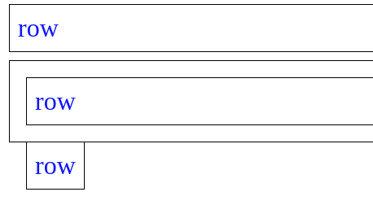
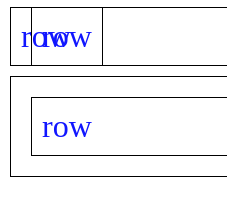
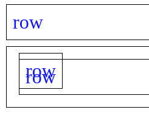
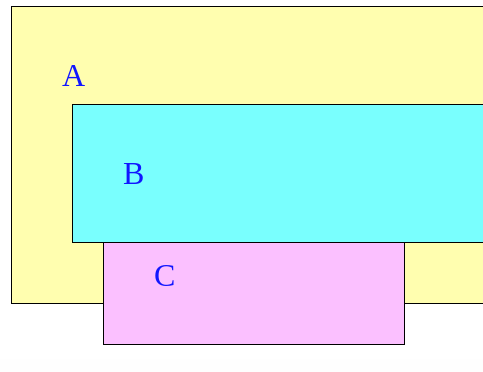
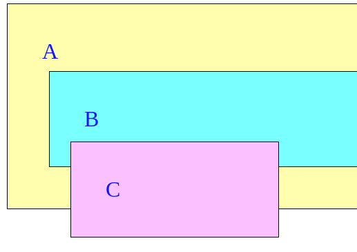

# CSS

## 选择器优先级

内容基本来自<https://developer.mozilla.org/zh-CN/docs/Learn/CSS/Building_blocks/Cascade_and_inheritance>，[这里](https://specifishity.com/)有个有趣的图示。

以下选择器优先级是递增的：

1. 元素选择器，例如`h1`，伪元素`::before`；
2. 类选择器，例如`.class`，属性选择器`[type="radio"]`，伪类`:hover`；
3. ID选择器，例如`#id`；
4. 内联样式`style="color: red"`总会覆盖外部样式表的任何样式，因此可以看作是具有最高的优先级；
5. `!important`例外规则将覆盖任何其他声明，冲突时按照优先级进行采纳。

通用选择器`*`、组合运算符`+`、`>`等不会影响优先级，`:where()`简写也不会影响选择器优先级。否定选择器`:not()`和匹配选择器`:is()`本身不影响，但它们的参数中，对优先级算法有贡献的参数优先级的最大值将作为该伪类选择器的优先级。

对于复合选择器，其优先级由三个不同的值（或分量）组成，这三个值来自ID、类（属性、伪类）、（伪）元素选择器：

| 选择器 | ID | 类 | 元素 | 优先级 |
| ---- | ---- | ---- | ---- | ---- |
| `h1 + p::first-letter` | 0 | 0 | 3 | 0-0-3 |
| `li > a[href*="en-US"] > .class` | 0 | 2 | 2 | 0-2-2 |
| `button:not(#id, .class)` | 1 | 0 | 1 | 1-0-1 |

比较时，按照从左到右，同级别数字先比较，相等才到下一个级别，如果全部相等，则按照出现在文档中的顺序，越靠后优先级越高。高优先级的样式并不是完全替代低优先级的样式，而是会覆盖冲突的属性。

## 盒模型与布局流

每个CSS元素都被一个个“盒子”所包裹，这些盒子在页面流中占据重要地位。有两种盒子：块级盒子（block box）和内联盒子（inline box）。

块级盒子：

+ 在内联方向上拓展，并占据父容器在该方向的所有可用空间，直观理解就是默认占据`100%`宽度；
+ 每个盒子都会换行；
+ `padding`、`margin`、`border`会将周边盒子“推开”。

在没有特殊指定的情况下，典型的块级元素有`<p>`、`<div>`等。

下面Vue代码片段中，两个盒子各自占满一行（在内联方向上拓展，每个盒子都换行），且之间的空隙是`10px`（`margin`推开其他元素，且发生了外边距折叠）。

```html
<template>
  <div>
    first
  </div>
  <div>
    second
  </div>
</template>
<style lang="scss" scoped>
div {
  margin: 10px;
}
</style>
```

内联盒子：

+ 盒子不会换行；
+ `width`和`height`属性不起作用；
+ 垂直方向的`padding`、`margin`及`border`会叠加而不是将其他内联盒子推开；
+ 水平方向的`padding`、`margin`及`border`会将其他内联盒子推开。

在没有特殊指定的情况下，典型的内联元素有`<a>`、`<span>`等。

下面Vue代码片段中，给`<span>`设置`width`不会起作用，同时每个`<span>`之间的水平缝隙是`20px`（水平方向的`margin`会推开其他内联盒子，但无外边距重叠）。

```html
<template>
  <span>first</span>
  <span>second</span>
</template>
<style lang="scss" scoped>
span {
  margin: 10px;
}

span:first-child {
  width: 400px; /* not work! */
}
</style>
```

完整的盒子模型主要用于块级盒子，内联盒子只用到了模型中的一部分内容。一个块级盒子从内到外分别是：content、padding、border、margin。默认情况下给盒子设置`width`和`height`设置的是content box，计算整个盒子的大小时还会加上盒子的`padding`与`border`。可以通过设置`box-sizing`来控制这一行为，默认值是`content-box`，可设置为`border-box`不计入padding box。

下面的例子中第二个`div`设置了`border-box`，因此padding box限制在宽高所定义的矩形内：

```html
<template>
  <div>
    first
  </div>
  <div>
    second
  </div>
</template>
<style lang="scss" scoped>
div {
  width: 200px;
  height: 100px;
  padding: 50px;
  border: 4px solid black;
  margin: 50px;
  background-color: grey;
}

div:last-child {
  box-sizing: border-box;
}
</style>
```

### 外边距重叠

外边距重叠指的是块的上外边距和下外边距有时合并（折叠）为单个边距，取其中较大值的现象，浮动元素和绝对定位元素不会产生外边距重叠行为。

1. 同一层相邻元素之间，前面已经给过例子；
2. 没有内容将父元素和后代元素分开，比较典型的例子是父元素和最后一个子元素的`margin-bottom`；
3. 空的块级元素，即该元素的上下`margin`直接贴合的时候。

### 布局流

默认模式下：

1. 块级元素的内容宽度是父元素的100%，高度由内容高度确定；
2. 内联元素的宽高均与内容一致且无法修改。如果想控制内联元素的尺寸，需要设置`display: block`或`display: inline-block`等；
3. 在自上而下、水平书写的模式里，块级元素是垂直组织起来的。内联元素不会另起一行，只要在其父级块元素宽度内有足够的空间，就会放在同一行，空间不够才溢出换行。

## `display`属性

只列举了常用的几个：

+ `block`：元素会生成块级盒子；
+ `inline`：元素会生成内联盒子；
+ `inline-block`：元素表现的像是内联元素，但是像块级元素一样可以设置宽高；

## `position`属性

只列举了常用的几个：

+ `static`：默认值，处在正常的文档流中，这样的元素（及无`position`设置的元素）称为无定位元素；
+ `relative`：处在正常的文档流中，但可以通过`top`、`left`等设置相对于应有位置的偏移；
+ `absolute`：元素脱离正常的文档流，默认相对于其位置最近的祖先而定位。通过`top`、`left`等可以设置相对于包含元素边界的偏移，包含元素的判定方法如下：
    1. 如果所有的父元素都没有显式地定义`position`属性（都是默认值`static`），那么会将初始包含容器作为包含元素，简单理解就是在`<html>`元素外面，相对视口进行定位；
    2. 如果某个父元素设置了相对位置`positon: relative`，那么该元素会成为包含元素，如果多个父元素都设置了，则最近的祖先会成为包含元素。

    下面Vue代码片段中，`.container`容器内第二个`<div>`被设置为绝对定位元素，将脱离文档流并排布在祖先`.container`后面：

    ```html
    <template>
      <div>
        row
      </div>
      <div class="container">
        <div>
          row
        </div>
        <div>
          row
        </div>
      </div>
    </template>
    <style lang="scss" scoped>
    div {
      padding: 10px;
      border: 1px solid black;
      margin: 10px;
    }

    .container div:last-child {
      position: absolute;
    }
    </style>
    ```

    

    但该元素的包含容器并不是`.container`容器，而是初始包含元素，因此如果我们设置`top: 0`的话，将被移动到顶端：

    ```diff
    .container div:last-child {
      position: absolute;
    +  top: 0;
    }
    ```

    

    如果我们给直接父元素设置`position: relative`，则包含元素变为`.container`元素，`top: 0`也是相对于它来说的：

    ```css
    .container {
      position: relative;
    }
    ```

    

+ `fixed`：默认相对于其位置最近的祖先而定位。通过top、left等可以设置相对于视口边界的偏移；
+ `sticky`：

## `z-index`和层叠上下文

默认情况下，当没有元素包含`z-index`属性时，元素按照如下方式从z轴自下而上堆叠：

1. 根元素的背景和边界；
2. 普通流里面的块元素（`position`为默认值）按照HTML里面的出现顺序堆叠；
3. 定位元素按HTML中的出现顺序堆叠。

`z-index`只对设置了`position`的元素有效，`z-index`值从小到大依次接近观察者，默认为第0层。在同一层内，将按照上面的默认规则进行布局。

`z-index`能调整某些元素的渲染顺序，有时又不能，其根本原因是为这些元素设置`z-index`值将创建一个独立的层叠上下文。层叠上下文的概念和图层比较类似，具有以下特点：

1. 层叠上下文可以嵌套，在父层叠上下文中可以创建多个子级层叠上下文并形成层叠上下文的层级；
2. 每个层叠上下文与其兄弟元素完全独立，处理层叠时只考虑内部子元素；
3. 每个层叠上下文是自包含的，当在父层叠上下文中发生层叠时，该层叠上下文会被看成一个整体进行层叠。

典型的会创建层叠上下文的元素有：

1. 文档根元素`<html>`；
2. `position`为`absolute`或`relative`，且`z-index`值不为`auto`的元素；
3. `position`为`fixed`或`sticky`的元素；
4. `flex`或`grid`容器的子元素，且`z-index`不为`auto`；
5. `opacity`小于1的元素；
6. `transform`、`filter`、`clip-path`等属性值不为`none`的元素。

下面Vue代码片段中，C排布在A和B的中间。一共存在有三个层叠上下文，A没有特别设定，处在`<html>`所创建的层叠上下文中，B和C是定位元素，且设置了不为`auto`的`z-index`值，故各自创建了一个层叠上下文，根据各自的`z-index`值在根层叠上下文中堆叠：

```html
<template>
  <div class="a">
    A
    <div class="b">
      B
    </div>
  </div>
  <div class="c">
    C
  </div>
</template>
<style lang="scss" scoped>
div {
  padding: 50px;
  border: 1px solid black;
  margin: 10px;
}

.a {
  background-color: #ffffaf;
}

.b {
  position: relative;
  z-index: 2;
  background-color: #5fffff;
}

.c {
  position: absolute;
  z-index: 1;
  top: 000200px;
  left: 100px;
  width: 200px;
  background-color: #ffbfff;
}
</style>
```



假如我们删掉`.b`的`position: relative`，则B退化为普通非定位元素，`z-index`值不起作用，和A处在同一个层叠上下文中，而C作为定位元素处在更高的层叠上下文中，故C会移动至B的上面。

```diff
.b {
-  position: relative;
  z-index: 2;
  background-color: #5fffff;
}
```



假如我们给`.a`添加`position: relative`和不为`auto`的`z-index`，则A也会创建一个层叠上下文，并且由于B是A的子级，B所创建的层叠上下文是A所创建层叠上下文的子级，形成如下结构：

```
- Root
  - A
    - B
  - C
```

假如给A设置的`z-index`值为`-1`，即使B设置的`z-index`是`2`，由于其作为A整体的一部分与C进行堆叠，依然处在C的下方：

```diff
.a {
+  position: relative;
+  z-index: -1;
  background-color: #ffffaf;
}
```

## CSS单位

## Flex和Grid布局

容器级别：

1. `flex-direction`：确定主轴方向；
2. `flex-wrap`：轴线上排不下时的换行方式；
3. `justify-content`：主轴对齐方式；
4. `align-items`：交叉轴对齐方式：
5. `align-content`：多轴对齐方式，如果只有一根轴线则不起作用。

子项级别：

1. `order`：项目的排列顺序，越小越靠前；
2. `flex-grow`：项目放大比例，默认为`0`，即使有剩余空间也不会放大；
3. `flex-shrink`：项目缩小比例，默认为`1`，即如果空间不足会缩小；
4. `flex-basis`：项目占据的主轴空间，默认为`auto`，即项目的本来大小；
5. `align-self`：定义自身的对齐方式，可覆盖容器`align-items`属性。

子项`flex`属性是`flex-grow`, `flex-shrink`和`flex-basis`的简写。`flex: initial`为`0 1 auto`；`flex: <positive number>`代表`flex: <positive number> 1 0`；`flex: auto`等价于`flex: 1 1 auto`；`flex: none`等价于`flex: 0 0 auto`。

我之前面临的兼容性问题比较严重，业务要求适配低端机型，Grid布局用得很少，差不多还只是现查现用的状态。

#### 瀑布流

瀑布流布局算是前端一个比较常见的需求，在各种图片展示的场景都会遇到。我的解决方法也是从网上学来的：如果数据量固定且有限的话，可以利用`columns`做分列；如果是那种无限滚动加载的，用`flex`或者`grid`好像都行。`flex`设置两层容器，外层主轴水平负责分列，内层主轴垂直负责单列内容；`grid`的主要技巧是设置一个很小的固定行高`grid-auto-rows`，对每个元素都设置`grid-row-start: auto`自适应上边框所在网格线，然后用JS获取图片高度再除以这个固定高度以得到该图片应占据的行数，这样就可以通过设置`grid-row-end: span <行数>`实现动态行高；具体实现上为了展示效果的均衡还需要统计每列的高度，每次将图片填充到最短的列中。

然而条件允许的话在生产级代码中我只会默默找出isotope之类的开源库，避免自己花费太多时间在这些不喜欢的事情上……

## BEM

## Atomic CSS和Taiwind

## Headless UI
