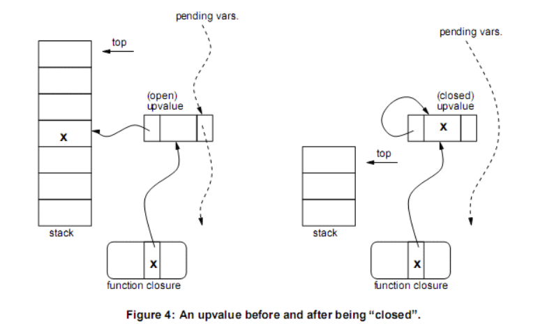

# 前端与编译原理

## 递归下降与移入归约算法

归类到[算法这里](./DataStructure-Algorithm.md#Hd3f7a909e72cee12)了。

## AST与访问者模式

## IR、BB、CFG...

## 语言运行时

### AOT和JIT

### Closure闭包的处理

闭包是词法作用域的体现，是一个运行时的概念（与函数这个静态概念相对，函数指的通常就是那段代码），可以理解为函数的“实例化”。在以函数为一等公民的语言中，通常会允许函数捕获外部环境的一些变量在函数体内使用，这个函数连同它所捕获的外部环境在一起被称之为闭包。闭包实现上要解决的问题是变量生命周期的问题，对于一般的函数体内定义的变量，随着函数的执行完毕栈帧回收也就销毁了，但是FP中函数会作为变量传来传去，那么它所引用的变量就可能存活更长的时间，比如下面这个例子：

```js
function outer() {
  const x = 42;
 
  return function inner() {
    console.log(x);
  }
}

const foo = outer();

foo();
```

`inner`捕获了外部的`x`，如果`outer`执行完其栈帧被销毁，那么调用`foo`时`x`已经不存在了，不是我们想要的行为。因此函数式语言创建闭包的一个重要过程就是将闭包捕获的变量迁移到堆上，经典的实现如Lua，Lua为了避免复杂的数据流分析，使用了一种叫做upvalue的结构来实现闭包。对任何外部变量的访问都通过upvalue进行，upvalue最初指向栈中的变量，一旦要离开该变量的作用域（栈帧要销毁），就将变量拷贝到upvalue中。

> 声明该变量的函数自身不需要通过upvalue访问，直接在自己的栈中访问这个局部变量就行了。

这种实现有一个问题是假如多个内层函数都要捕获这个变量该怎么办呢？为了避免创建多个冗余的upvalue（冗余还导致需要同步更新），Lua将upvalue维护成链表，每当创建一个闭包时（此时正在执行的函数就是闭包的直接外层函数），对于每个闭包用到的非局部变量，它首先遍历upvalue链表，如果已存在于upvalue链表中则复用之。

下图左为捕获变量所在函数还存在于栈上时的情况（opened），右为栈帧销毁后的情况（closed），变量x被拷贝到了upvalue中：



还有更复杂的情况，闭包捕获的变量可能位于更外层，例如下面的例子，最内层函数`baz`捕获了最外层的`x`，由于当`bar`执行的时候才会创建`baz`闭包，而`bar`本身也是逃出了`foo`的作用域的，因此创建`baz`闭包时`foo`的环境可能早就被销毁了。Lua的解决方案是创建flat闭包：无论何时只要函数存取更外层的局部变量（这一点在编译期静态分析就可以知道），该变量也会进入其直接外层函数的闭包（upvalue表）中。产生的效果和下面注释掉的代码类似，具体实现上是在`bar`闭包的upvalue表中添加`x`，看起来好像`bar`捕获了`x`一样：

```js
function foo() {
  const x = 0;

  return function bar() {
    // const dummyX = 0;
    return function baz() {
      console.log(x);
    }
  }
}
```

### GC垃圾收集

#### 引用计数

#### 标记清扫

把变量（在堆上的记录）当作一个起始结点，变量中对其他变量的引用会形成一个有向图，那么每个变量出发去做DFS遍历，剩下的没被标记的结点就是垃圾。这些清理出来的垃圾可以用空闲链表的方式进行管理。

#### 代际收集

### 尾调用优化

首先理解为什么可以进行尾调用优化，如果函数调用处在“尾位置”，我们把调用者称为`caller`、被调用者称为`callee`，那么`callee`执行完成后由于`caller`没有剩余步骤，可以直接返回到`caller`的`caller`，体现在调用栈上，则调用`callee`时可以直接销毁`caller`的栈帧，再创建`callee`的栈帧，避免了一层额外的栈帧和设置寄存器返回值之类的额外步骤，有助于提高程序性能和避免堆栈程度过深。

日常开发中，尾调用优化主要应用在递归调用上，关键技巧是将中间值作为参数传递。比如下面这个函数，`listSum`的递归调用没有出现在尾位置上：

```js
function listSum(l) {
  if (l.length === 0) return 0;

  const intermediateValue = listSum(l.slice(1)); // not a tail call !

  return l[0] + intermediateValue;
}
```

优化后：

```js
function listSumHelper(l, intermediateValue) {
  if (l.length === 0) return intermediateValue;

  return listSumHelper(l.slice(1), l[0] + intermediateValue);
}

function listSum(l) {
  return listSumHelper(l, 0);
}
```

Typescript编译器现在支持尾递归优化，这个技巧经常在TS类型元编程中用到。

## 编译优化

别问，不会。本科阶段我的编译原理学习只持续到相当基础的数据流分析，对迭代到不动点还有什么sound complete还算有所耳闻，再深入的别名分析循环优化指令调度等等等等就一窍不通了，目前还在接触公开课试图系统性学习的阶段。

## DSL？
