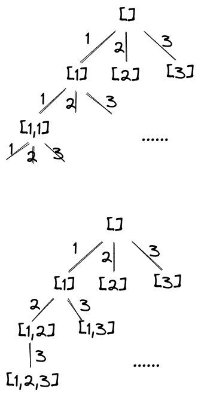

# 前端与算法和数据结构

> 写完发现数据结构的内容有点少，大概是因为常见的数据结构已经“润物细无声”了，很多是基础中的基础，而复杂的数据结构作为前端开发者来说应用得很少一时半会想不到。

我的算法挺烂的，一直觉得思路混乱没有条理，尤其讨厌在限定时间内面向Accept编程，刷LeetCode全靠套路，么得技巧。我是那种从暴力解法开始旁敲侧击寻求理解的风格，非常花时间，因此对大佬的灵光一闪只有叹为观止的份儿。看过比较推荐的算法教程是[LABULADONG 的算法网站](https://labuladong.github.io/algo/)，这老哥给我的感觉是语言朴实，各种见解的抽象程度很高，很多地方让人有拨云见日茅塞顿开醍醐灌顶恍然大悟之感，值得一读。

## 线性表

线性表常见的技巧是双指针，其中又可以分为快慢指针和左右指针两大类。快慢指针通常根据两个指针的交汇与否判断线性表的特征，有时还需要数组有序。左右指针可以从二分法的角度理解，更多的用于滑动窗口问题。我学来的一套滑动窗口极简框架如下，思路基本都是先尽可能增大窗口，然后判断`shouldShrink`缩小窗口：

```js
void slideWindow(str) {
  let left = 0;
  let right = 0;

  while (left <= right && right < str.length) {
    if (shouldShrink(left, right)) {
      // 缩小窗口
      left++;
    } else {
      // 增大窗口
      right++;
    }
  }
}
```

有关线性表的一个重要思想是“所有的数据结构其实都是线性表，只是我们对数据的解释方式不同”，这就好比对同一段二进制数据可以按照大端小端补码原码进行解释一样。从这个角度再去理解不同解释方式的特点很有启发。

有时链表问题的边界处理不太方便，可以考虑设置一个虚拟结点辅助解决。

## Backtrace回溯

这句话说得真是好：**回溯算法是在遍历“边”，DFS 算法是在遍历“节点”**。因为要遍历边，我们要在递归进入结点之前选中边，从结点子树出来之后，要取消选择然后选中兄弟边。每个边对应一个选择，通常用一个`for`循环遍历这些选择，而边下面的结点就是做了这个选择之后的结果。由此总结出回溯法的一般框架：

```js
void backtrace(nums) {
  // 对结点（选择后的结果）进行处理
  handleNode();

  for(let i = 0; i < nums.length; ++i) {
    // 剪枝
    if (shouldSkip(i)) continue;
    // 选中边
    choose(nums[i]);
    // 遍历子树
    backtrace(nums);
    // 取消选择
    unchoose(nums[i]);
  }
}
```

根据题目要求的不同，选中边之后的递归遍历`backtrace(nums)`也有说法，有时可能是`backtrace(nums.slice(i))`，分别对应如下回溯树（假定选项是1，2和3）：



后者可以通过前者剪枝得到。剪枝算是回溯的难点所在，但做多了也察觉到套路。~我就没有哪一次能秒杀成功的~，经验是把错误答案打印出来，辅助画出回溯树然后分析是那里没剪好。一般要把原始数据先排序，然后在`for`循环的索引上做文章，例如比较`nums[i]`和`nums[i-1]`的大小，索引不是自增1而是直接跳到非重复数据等等。

## DP动态规划

## BFS和Dijkstra最短路径

## Max Flow和Min Cut最大流最小割

## BST二叉平衡树

## LCA最近公共祖先

LCA问题没啥好说的，如果是普通的二叉树，某结点的左右子树分别含有目标结点就是LCA；如果是二叉搜索树，根据左小右大的性质可以优化搜索；如果结点中有指向父级的指针，可以当作链表问题用双指针求交汇点。将LCA单独列为一节是因为我想起了一个让我感觉很失败的需求。

在前端业务中，保持“原进原出”或者跳过中间页面返回到最开始处都是很普遍的要求，但项目规模大起来之后维护好路由栈也并不容易（我的经验是画状态图辅助分析）。当这些需求和缓存问题混合起来之后，情况会变得更加复杂。我当时遇到的问题简化如下：


这是一个Vue项目，`<Root>`、`<Home>`和`<Posts>`（图中标绿）均有`<router-view>`形成嵌套路由，要求在`<Profile>`和`<History>`（图中标橙）之间跳转时各自都被缓存，而跳转到其他页面，比如`<Recent>`或`<About>`时不缓存，`<Recent>`时刻保持最新。需求的难点不在于如何缓存（Vue提供了现成的`<keep-alive>`组件），而在于缓存设施应该铺设在哪里，以及尽可能避免缓存不必要的页面。

动态决定是否需要缓存可借助`<keep-alive>`组件的`include`或`exclude`API，所以我们要做的就是利用VueRouter的全局路由守卫，如`beforeEach`触发的时机要早于前置页面失活的时机`deactivated`或`beforeDestroy`，故可在页面失活前判断是否要缓存并修改`include`配置。为了尽可能减少影响面，`<keep-alive>`应放置在`<Profile>`和`<History>`的最近公共祖先`<Home>`处。

看着很简单对吧，但实际上`<Posts>`处也要设置`<keep-alive>`，这是`<keep-alive>`和`<router-view>`配合不好的地方，我在[这里](https://github.com/vuejs/core/issues/906#issuecomment-611080663)看到一些关联解释，从`<History>`前往`<Profile>`，`<Home>`处的`<keep-alive>`只能看到`<Posts>`里面的`<router-view>`，看不到选中的次级组件`<History>`，在`<Posts>`处使用`<component :is="?">`而非`<router-view>`就不会有这样的问题。但仅使用`<component :is="?">`，则失去了路由守卫那部分逻辑，又使`<Recent>`被错误地缓存。

那好，`<Posts>`还是使用`<router-view>`，但我们给它配上`<keep-alive>`？于是为了避免错误地缓存`<Recent>`又需要维护一个`include`配置，而且由于`<keep-alive>`的限制，从`<History>`跳转至`<Profile>`，`<Home>`处的缓存配置应记载`<Posts>`的名字而非`<History>`的，这意味着即使目的是缓存同一个页面，`<Post>`和`<Home>`处的两套配置还不一样，再考虑各种边界情况如组件名称的重复、懒加载页面首次进入前如何获取名称……我最早打算把这个逻辑抽离出来，使之能应对各种层级各种深度的页面结构，结果复杂度远远超出了刚开始的预期。工期紧迫，最后只想到用“刷新”代替“不缓存”，判断前置和当前页面的“颜色”决定进入后是否要刷新，离开前是否要缓存：

1. 若当前页面是白色，则始终需要刷新，离开时理论上不必缓存，但由于刷新的存在，缓存了也没有关系，这是简化逻辑的关键；
2. 若当前页面是橙色，离开时始终缓存，根据前置页面是不是白色来决定是否需要刷新。

于是，不再需要维护麻烦的`include`和`exclude`规则，统一缓存再根据刷新就好了，缺点当然是额外的内存占用，以及刷新那一下的“闪烁”效果。

## UF并查集

[这篇文章](https://labuladong.github.io/algo/di-yi-zhan-da78c/shou-ba-sh-03a72/bing-cha-j-323f3/)基本把我想知道的并查集内容讲清楚了。并查集的核心在于利用二叉树的思想减少所要遍历的结点个数，并的过程采用了和建哈夫曼树类似的贪心策略，总是把小树连到大树以限制树高；查的过程就是个链表LCA问题。并查集的应用在于对“连通性”的理解，什么叫“连通性”，连通性即具有等价关系，于是并查集提供了将一类具有等价关系的结点连到一起的方法，形成分类。

## CRC循环冗余

## Recursive Descent递归下降

## Shift Reduce移入归约

## Diff Patch算法

