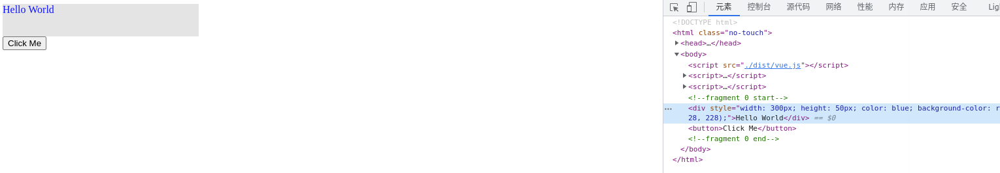
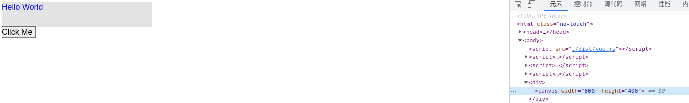

# 主流前端框架

## Web应用框架

本文主要介绍React和Vue，前者做为FP思想的范例，后者作为OOP思想的范例，把握住这两点，很多问题就迎刃而解了。后来出现的Svelte、Solid等，个人觉得只是在VDOM应用与否、模板预编译优化程度上的取舍，在Web这个特定场景可能有进一步的性能提升，但总体来说并没有特别让人眼前一亮的地方。而且我非常讨厌Svelte又双叒创造了一套模板语法的行为。

比较特殊的是Angular，将Spring那套控制反转和依赖注入的思想引入了前端应用的设计中，能够理解IOC和DI，并且知道[怎么用`reflect-metadata`实现装饰器](https://www.everseenflash.com/CS/Snippets/Macro.md#H047e72df69d52b2e)的话Angular也没什么神秘的。甚至有巨硬官方的[轮子](https://github.com/microsoft/tsyringe)可以复用。我的观点和社区里一些观点一致，Angular更适合专业性比较高的大型团队使用，想用好有一定的门槛和心智负担，普通开发者和小型团队使用可能还适得其反。

### Virtual DOM

写这篇文档的时候我思考了一下到底该如何表达出自己对React和Vue的理解，因为关于这两个框架的面试问题非常之多，有些浮于表面，只是一个毫无价值的实现细节或者接口特征，真正深入肌理的少之又少。为了避免在这些肤浅的面试问题上浪费太多生命，我决定做一件很早就想做却迟迟没有开始的事情：实现一个微型的React和Vue。让我们从Virtual DOM开始。

计算机行业貌似有一个段子，各种软件造来造去，最后发现其实都是在造编译器或者操作系统。这个段子对前端框架也适用，把JSX、Vue或其他什么框架的模板语法看成是输入，HTML看成是输出，那么各种前端框架不就是一个编译器吗？而VDOM，显而易见的，和AST/IR等处在同一个位置，是一种中间表示。中间表示最核心的优点是什么？提供一个抽象层，可以在其基础上做分析优化，可以实现为不同目标平台上的机器码。那么VDOM也类似的，通过对VDOM树的分析操作可以避免每次重新执行整个组件树，可以避免在内存中维护庞大的真实DOM结点，通过不同的后端（这里指编译器后端）实现，可以输出到不同的渲染平台，如下图：


假如前后端分离，服务器承担编译器前端的工作，负责生成VDOM，客户端承担编译期后端的工作，负责渲染VDOM，这是不是就是React正在探索的Server Components背后的思想？进一步畅想：如果随着技术的发展AR/VR已经大行其道，成为前端展示层的主流，难道我们就会抛弃现有的前端框架了吗？很可能不会，React/Vue说到底只是一套设计和管理前端应用的方法，也许那时只要在现有的VDOM基础上缝缝补补就可以输出为AR/VR的渲染指令。受此启发，像AST这种中间表示，现有的前端框架基本都是某种求值器，求值过程为创建对应的HTML元素，但AST还可以编译为IR进一步编译为在CPU上执行的二进制指令，类比一下完全有可能将VDOM编译为GPU渲染指令，并且将各种编译优化手段应用到这个过程中去。这也是我当前正在探索的东西。

作为示例，我们设计一套极简的VDOM，只有几个结点类型：

1. `fragment`，类似React中的`<></>`，用于组织元素；
2. `div`，作用和HTML的块级元素类似；
3. `text`，代表纯文本；
4. `button`，用于演示用户操作。支持的HTML属性也非常有限，只有`style`和`onclick`。

#### 求值器

下面以`button`为例说明它们的接口定义和“求值”过程，完整代码见[这里](https://github.com/EverSeenTOTOTO/mini-framework/blob/main/src/vdom/target-web.ts)：

```ts
export type VNodeButton = {
  tag: 'button',
  attr?: {
    style?: AttrStyle,
    onClick?: AttrEvent
  },
  children: VNode[],
};
```

为了方便构造VDOM树，还可以编写一个工厂函数`createElement`，作用等同于React的`createElement`和Vue渲染函数中的`h`：

```ts
const createElement = <Tag extends VNodeTags>(tag: Tag) =>
  (children: (VNode | string)[], attr?: GetVNodeAttrType<Tag>) => ({
    tag,
    attr,
    children: children.map(mapVNode),
  } as GetVNodeType<Tag>);

export const fragment = createElement('fragment');
export const div = createElement('div');
export const button = createElement('button');
```

“求值”其实就是创建对应的DOM结点，对`children`的求值是一个递归下降的过程：

```ts
export function evalButton(node: ts.VNodeButton): HTMLButtonElement {
  const btn = document.createElement('button');

  if (node.attr?.style) {
    bindStyle(btn, node.attr.style);
  }

  if (node.attr?.onClick) {
    btn.addEventListener('click', node.attr.onClick);
  }

  btn.append(...evalSeq(node.children)); // 递归下降

  return btn;
}
```


这样我们的框架后端（指编译器后端，在这里是求值器）就初步可用了，下面是一个简单的用例：

```html
<script>
  const {fragment, div, button} = window.Demo;

  const vdom = fragment([
    div(
      ['Hello World'],
      {
        style: {
          width: 300,
          height: 50,
          color: 'blue',
          bgColor: '#e4e4e4'
        },
      },
    ),
    button(
      ['Click Me'],
      {
        onClick: () => console.log('hello world'),
      },
    ),
  ]);
</script>
<script>
  const {evalVNode} = window.Demo.web;

  document.body.append(...evalVNode(vdom));
</script>
```

渲染效果如下：



#### 编译器

如前文所述，既然求值可行，那我们把同一套VDOM翻译成渲染指令（类比汇编代码）保存下来当然也是可行的。为此让我们先设计几个简单的虚拟渲染指令：

1. `moveTo x, y`: 移动指针到坐标`(x, y)`处；
2. `fillStyle style`: 改变填充色；
3. `strokeStyle style`: 改变描边色；
4. `fontStyle family, size`: 改变字体样式；
5. `fillRect x, y, w, h`: 填充矩形，左上角位置`(x, y)`，宽高为`(w, h)`；
6. `strokeRect x, y, w, h`: 描边矩形，左上角位置`(x, y)`，宽高为`(w, h)`；
7. `fillText text, x, y, maxw`: 在`(x, y)`处绘制文本，最大宽度`maxw`；
8. `reset`: 重置笔刷状态为默认值，重置指针到`(0, 0)`；
9. `save`: 保存笔刷状态（将颜色、字体大小等入栈）；
10. `restore`: 恢复笔刷状态（设置笔刷为栈顶状态，退栈）。

指令接口示例：

```ts
export type InstFillText = {
  name: 'fillText';
  text: string,
  x: number,
  y: number,
  maxw?: number
};
```

指令实现用的Canvas API，~其实设计也抄的Canvas API~。再次以`button`为例，给出翻译VDOM结点为渲染指令的过程，完整代码在[这里](https://github.com/EverSeenTOTOTO/mini-framework/blob/main/src/vdom/target-canvas.ts)：

```ts
export function emitButton(node: ts.VNodeButton, ctx: Context): RenderInst[] {
  const insts: RenderInst[] = [];
  const style = {
    // default button style
    width: 67,
    height: 21,
    color: '#000',
    bgColor: 'buttonface',
    ...node.attr?.style,
  };

  insts.push({ name: 'save' });
  insts.push(
    {
      name: 'fillStyle',
      style: style.bgColor,
    },
    { // 绘制按钮背景
      name: 'fillRect',
      x: ctx.x,
      y: ctx.y,
      w: style.width,
      h: style.height,
    },
    {
      name: 'strokeStyle',
      style: '#000',
    },
    { // 绘制按钮边框
      name: 'strokeRect',
      x: ctx.x,
      y: ctx.y,
      w: style.width,
      h: style.height,
    },
  );

  if (style.color) {
    insts.push({
      name: 'fillStyle',
      style: style.color,
    });
  }

  insts.push(...emitSeq(node.children, ctx)); // 递归下降

  if (node.attr?.onClick) {
    // 绑定canvas click事件，判断鼠标点击落点是否在区域内
    bindCanvasClick(node.attr.onClick, style, ctx);
  }

  insts.push({ name: 'restore' });

  return insts;
}
```

还是前面用例中的`vdom`，编译后得到如下渲染指令：

```js
[
  { name: 'reset' },
  { name: 'moveTo', x: 0, y: 0 },
  { name: 'fontStyle', size: 16, family: 'sans-serif' },
  { name: 'comment', message: 'fragment 0 start' },
  { name: 'save' },
  { name: 'fillStyle', style: '#e4e4e4' },
  { name: 'fillRect', x: 0, y: 0, w: 300, h: 50 },
  { name: 'fillStyle', style: 'blue' },
  { name: 'fillText', text: 'Hello World', x: 0, y: 16 },
  { name: 'restore' },
  { name: 'moveTo', x: 0, y: 50 },
  { name: 'save' },
  { name: 'fillStyle', style: 'buttonface' },
  { name: 'fillRect', x: 0, y: 50, w: 67, h: 21 },
  { name: 'strokeStyle', style: '#000' },
  { name: 'strokeRect', x: 0, y: 50, w: 67, h: 21 },
  { name: 'fillStyle', style: '#000' },
  { name: 'fillText', text: 'Click Me', x: 0, y: 66 },
  { name: 'restore' },
  { name: 'comment', message: 'fragment 0 end' },
],
```

在`canvas`上绘制，渲染效果看着还是挺能唬住人的：

```html
<script>
  const {emitInsts, execInst} = window.Demo.canvas;
  const canvas = document.createElement('canvas');

  canvas.width = 800;
  canvas.height = 400;

  const container = document.createElement('div');
  container.append(canvas);
  document.body.append(container);

  const ctx = canvas.getContext('2d');
  const insts = emitInsts(vdom);

  insts.forEach(inst => execInst(inst, ctx));
</script>
```



假如`vdom`保持不变的话，下次可以直接执行编译出来的渲染指令`insts`，省去了整个编译器前端部分的工作，这也是AOT的优势所在。更进一步还可以联想到JIT，一部分VDOM实时编译为“Hot”指令，一部分编译为“Cold”指令并缓存，大半个编程语言和编译原理领域的轮子都站在我们面前，能应用到什么程度全看个人能力了。

#### Diff Patch

Diff Patch的概念相当普遍，当我们需要同步某类数据结构S为T时，一种做法是直接将S整个换成T，比如双缓冲模式，可能交换下两个缓冲区指针就行了。但很多时候这么简单粗暴的替换会导致所有在S上已经做的工作丢失了，产生重复劳动。比如`npm install`生成`node_modules`的过程，如果无视本地已有的`node_modules`结构S，仅根据最新的依赖树结构T重新安装一遍，无疑会有很多不必要的下载、复制动作。对于Web框架，此处的“数据结构”即VDOM树，如果每次一点小更新都需要对整个VDOM树重新求值、创建DOM结点并替换原有的DOM结点，尽管表现出来的样式差异可能不大，但却破坏了浏览器渲染引擎底层已经创建好的真实DOM树，渲染引擎需要重新计算布局、样式等信息，造成大范围的reflow，所有相关的JS代码也需要重新执行一遍，比如重新绑定事件回调，这个代价几乎是不可接受的。

怎么办呢？既然整个替换不行，那就比对S和T的差异（Diff），仅对差异的地方做調整（Patch），把影响最小化呗。某种意义上这也是一种编译器，输入是数据结构S和T，输出是一系列动作（指令），指示我们该如何一步步操作S，将S变为T。举例来说，假如S和T是两个数组：

```ts
S = [1,2,3,4];
T = [1,3,3,2,4];
```

从S得到T有很多种方式，我们设计一套一步动作只更改一个位置的指令，那么对S和T做Diff Patch就是一个典型的“最小编辑距离”问题，比对之后得到的指令序列可能如下：

```ts
[
  { type: 'change', index: 1, value: 3 },
  { type: 'change', index: 3, value: 2 },
  { type: 'append', value: 4 }
]
```

回到Web框架，从前面的求值器实现中我们知道一个VDOM结点是可以和它所创建的真实DOM结点关联起来的，那就可以用一些Diff算法来比对新旧两棵VDOM树，对于有变化的结点，找到对应真实DOM结点将变更动作应用到上面去就是了。这个比对并生成动作的过程即所谓的`diff`过程，应用变更的过程即所谓的`commit`过程。还是举例说明：

```ts
const S = div(
  [
    span(['Hello']),
    span(['World'])
  ],
  {
    style: {
      color: 'blue',
    },
  }
);

const T = div(
  [
    span(['Diff Patch'])
  ],
  {
    style: {
      color: 'red',
    },
  }
);
```

使用某种Diff Patch算法之后得到的指令序列可能像下面这样，我用嵌套的`[]`来代表树操作的递归下降特性：

```ts
[
  [{ type: 'changeHTML', value: 'Diff Patch' }], // 第一个span
  [{ type: 'delete' }], // 第二个span
  { type: 'changeStyle', attr: 'color', value: 'red' } // div自身
]
```

React、Vue或者Preact的源码为什么难以读懂，很大程度上就是因为这些指令并没有显式、工整地出现在代码中，而是以各种标志位、属性值的方式存在。毫不客气地说，是缺少了对变更动作的抽象、用相当结构化的代码实现的。我们这个实验中的VDOM很简单，可以吸取它们的教训优化设计。

首先重写下`VNode`类型，添加一个字段`output`，用于关联该结点编译后的目标产物，例如求值创建的一个真实DOM结点，或者编译出的一组渲染指令等：

```diff
+ interface VNodeBase<T, Tag extends string> {
+   tag: Tag,
+   output?: T
+ }

- export type VNodeButton = { /* ... */ };
+ export interface VNodeButton<T> extends VNodeBase<T, 'button'> {
  attr?: {
    style?: AttrStyle,
    onClick?: AttrEvent
  },
  children: VNode<T>[],
}

export function evalButton(node: VNodeButton) {
  const btn = document.createElement('button');

  if (node.attr?.style) {
    bindStyle(btn, node.attr.style);
  }

  if (node.attr?.onClick) {
    btn.addEventListener('click', node.attr.onClick);
  }

  btn.append(...evalSeq(node.children));

+  node.output = [btn];

  return btn;
}
```

对产物的变更动作我们简单抽象为“增、删、改”三种，以求值器实现为例，“增”在指定位置插入结点，“删”删除当前结点，“改”修改属性，包括文本内容、样式、事件句柄等，以修改样式为例说明动作的定义和具体实现，完整代码见[这里](https://github.com/EverSeenTOTOTO/mini-framework/blob/main/src/vdom/diff-patch-web.ts)：

```ts
export type ActionChangeDetail = 'text' | 'style' | 'event';

export type ActionChange<Detail extends ActionChangeDetail, T> = {
  type: 'change',
  detail: Detail,
  value: GetActionChangeValue<Detail>,
  target: T,
};

function doChangeStyle(action: ActionChangeStyle) {
  if (!(action.target instanceof HTMLElement)) throw new Error('Target is not an HTMLElement');

  for (const prop of Object.keys(action.value)) {
    const style = action.value[prop];

    if (style) {
      action.target.style.setProperty(prop, style);
    } else {
      action.target.style.removeProperty(prop);
    }
  }
}
```

接着设计一套很Naive的Diff Patch算法，更多Diff Patch算法介绍见[这里](./DataStructure-Algorithm.md#H7465038581ab4d99)：

1. 假设旧VDOM结点为S，关联的真实DOM结点为R，新VDOM结点为T，比对它们的`tag`名称；
2. 如果S和T的`tag`不同：
    1. 删除R；
    2. 编译T，将得到的DOM结点其插入到R原先所在位置；
3. 如果S和T的`tag`相同：
    1. 若S和T的`tag`名称为`text`，比对两者的文本内容，若有变化，修改R的文本内容为T的；
    2. 比对S和T的`children`，即找出哪些结点需要新增，哪些结点需要删除，哪些结点`tag`没变只是索引变化：
        1. 对每个没变的子结点，假设在S和T中分别以N1和N2存在，对N1和N2重复调用此算法；
        2. 对每个待删除的子结点，从R中删除相关联的DOM结点；
        3. 对每个待新增的子结点，编译并将得到的DOM结点插入到R中；
    3. 比对S和T的`attr`，若有变化，修改R的属性为T的；
    4. 将R和T关联，以后将T作为新的S使用。

具体实现中用`actions`保存了所有生成的动作，没有现场执行，在React Fiber那里还会提到这样做的好处：

```ts
export function diffPatch(source: VNode, target: VNode) {
  if (source.tag !== target.tag) {
    // diffPatchReplace 里面会编译 target
    return diffPatchReplace(source, target);
  }

  if (source.tag === 'text') {
    return diffPatchText(source, target);
  }

  const actions: PatchAction[] = [];

  actions.push(...diffPatchChildren(source, target));
  actions.push(...diffPatchAttributes(source, target));

  // 复用source关联的DOM
  target.output = source.output;

  return actions;
}
```

对属性的Diff大多数时候是比较两个对象的键值对；对`children`的Diff是一个典型的“最小编辑序列”问题，我们限制编辑动作一次只能做一件事，这样所有动作的代价为1，通过比较序列的长度获取代价最小的编辑序列，动态规划解决。根据算法描述，设计了三种编辑动作：

1. `keep`：结点同时存在于S和T中，保留但递归下降比对子结点和属性；
2. `insert`：T中新增的结点；
3. `delete`：S中待删除的结点。

```ts
export function diffPatchChildren(source: VNodeWrap, target: VNodeWrap) {
  const editions = minimalEditSequence(source.children, target.children, compareVNode);
  const actions: PatchAction[] = [];

  editions.forEach((e) => {
    switch (e.action) {
      case 'keep':
        actions.push(...diffPatch(e.source!, e.target!));
        break;
      case 'insert':
        evalVNode(e.target!);
        actions.push({
          type: 'insert',
          index: e.index,
          target: source.tag === 'fragment' ? source.output![0].parentElement! : source.output![0],
          value: e.target!.output!,
        });
        break;
      case 'delete':
        actions.push({
          type: 'delete',
          target: e.source!.output!,
        });
        break;
      default:
        break;
    }
  });

  return actions;
}
```

现在可以实现我们自己的`render`函数了，用`old`保存旧的VDOM树，如果没有，说明是首次渲染，将`vdom`赋值给`old`并将渲染结果挂载到`container`上；如果已有`old`，则根据最新的`vdom`进行Diff Patch，逐个执行生成的动作：

```ts
let old: web.VNode | undefined;

export function render(vdom: web.VNode, container: HTMLElement) {
  if (old) {
    const actions = dp.diffPatch(old, vdom);

    actions.forEach((action) => dp.doAction(action));
  } else {
    web.evalVNode(vdom);
    container.append(...vdom.output!);
  }

  old = vdom;
}
```

修改一下前面的用例，用一个函数`component`包装生成VDOM树的过程，通过提供不同的外部状态`state`，我们可以复用这段逻辑，生成结构相近的VDOM树。组件的概念已经悄无声息地出现了：

```html
<script>
  const {fragment, div, button} = window.Vue;

  const component = (state) => fragment([
    div(
      [state.text],
      {
        style: {
          width: 300,
          height: 50,
          color: state.color,
          bgColor: '#e4e4e4'
        },
      },
    ),
    button(
      ['Click Me'],
      {
        onClick: state.onClick,
      },
    ),
  ]);
</script>
<script>
  const {render} = window.Demo;

  let state = {
    text: "Hello World",
    color: 'blue',
  }

  render(component(state), document.body);

  state = {
    text: "Frontend Framework",
    color: 'red',
    onClick: () => console.log("clicked")
  }

  setTimeout(() => render(component(state), document.body), 2000);
</script>
```

渲染效果如下，可以观察到2s后仅`div`发生了变更，`button`不受影响：

<video controls width="1200">
    <source src="./VDOM-render.mp4" type="video/mp4">

    Download the
    <a href="./VDOM-render.mp4">MP4</a>
    video.
</video>

Diff Patch同时也是实现SSR“水化”的关键，这是废话，不表。

### React

#### React Fiber

#### React hooks

#### React18的启示

### Vue

#### 观察者模式与对象代理

#### 依赖倒置原则与双向绑定

#### Vue3 hooks

### 状态管理与DDD

#### RxJS

## 单元测试

## 跨端解决方案

## 服务端框架

### Express和Koa

### Nest.js

### SSR框架

## 国际化与a11y

