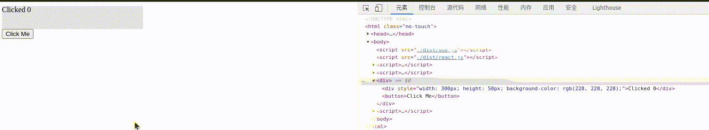

# 主流前端框架

## Web应用框架

本文主要介绍React和Vue，前者做为FP思想的范例，后者作为OOP思想的范例，把握住这两点，很多问题就迎刃而解了。后来出现的Svelte、Solid等，个人觉得只是在VDOM应用与否、模板预编译优化程度上的取舍，在Web这个特定场景可能有进一步的性能提升，但总体来说并没有特别让人眼前一亮的地方。而且我非常讨厌Svelte又双叒创造了一套模板语法的行为。

比较特殊的是Angular，将Spring那套控制反转（IOC）和依赖注入（DI）的思想引入了前端应用的设计中，能够理解IOC和DI，并且知道[怎么用`reflect-metadata`实现装饰器](https://www.everseenflash.com/CS/Snippets/Macro.md#H047e72df69d52b2e)的话Angular也没什么神秘的。甚至有巨硬官方的[轮子](https://github.com/microsoft/tsyringe)可以复用。我的观点和社区里一些观点一致，Angular更适合专业性比较高的大型团队使用，想用好有一定的门槛，普通开发者和小型团队使用可能适得其反。

### Virtual DOM

写这篇文档的时候我思考了一下到底该如何表达出自己对React和Vue的理解，因为关于这两个框架的面试问题非常之多，有些浮于表面，只是一个毫无价值的实现细节或者接口特征，真正深入肌理的少之又少。为了避免在这些肤浅的面试问题上浪费太多生命，我决定做一件很早就想做却迟迟没有开始的事情：实现一个微型的React和Vue。让我们从Virtual DOM开始。

计算机行业貌似有一个段子，各种软件造来造去，最后发现其实都是在造编译器或者操作系统。这个段子对前端框架也适用，把JSX、Vue或其他什么框架的模板语法看成是输入，HTML看成是输出，那么各种前端框架不就是一个编译器吗？而VDOM，显而易见的，和AST/IR等处在同一个位置，是一种中间表示。中间表示最核心的优点是什么？提供一个抽象层，可以在其基础上做分析优化，可以实现为不同目标平台上的机器码。那么VDOM也类似的，通过对VDOM树的分析操作可以避免每次重新执行整个组件树，可以避免在内存中维护庞大的真实DOM结点，通过不同的后端（这里指编译器后端）实现，可以输出到不同的渲染平台，如下图：


假如前后端分离，服务器承担编译器前端的工作，负责生成VDOM，客户端承担编译器后端的工作，负责渲染VDOM，这是不是就是React正在探索的Server Components背后的思想？进一步畅想：如果随着技术的发展AR/VR已经大行其道，成为前端展示层的主流，难道我们就会抛弃现有的前端框架了吗？很可能不会，React/Vue说到底只是一套设计和管理前端应用的方法，也许那时只要在现有的VDOM基础上缝缝补补就可以输出为AR/VR的渲染指令。受此启发，像AST这种中间表示，现有的前端框架基本都是某种求值器，求值过程为创建对应的HTML元素，但AST还可以编译为IR进一步编译为在CPU上执行的二进制指令，类比一下完全有可能将VDOM编译为GPU渲染指令，并且将各种编译优化手段应用到这个过程中去。这也是我当前正在探索的东西。

作为示例，我们设计一套极简的VDOM，只有几个结点类型：

1. `fragment`，类似React中的`<></>`，用于组织元素；
2. `div`，作用和HTML的块级元素类似；
3. `text`，代表纯文本；
4. `button`，用于演示用户操作。支持的HTML属性也非常有限，只有`style`和`onclick`。

#### 求值器

下面以`button`为例说明它们的接口定义和“求值”过程，完整代码见[这里](https://github.com/EverSeenTOTOTO/mini-framework/blob/main/src/vdom/target-web.ts)：

```ts
export type VNodeButton = {
  tag: 'button',
  attr?: {
    style?: AttrStyle,
    onClick?: AttrEvent
  },
  children: VNode[],
};
```

为了方便构造VDOM树，还可以编写一个工厂函数`createElement`，作用等同于React的`createElement`和Vue渲染函数中的`h`：

```ts
const createElement = <Tag extends VNodeTags>(tag: Tag) =>
  (children: (VNode | string)[], attr?: GetVNodeAttrType<Tag>) => ({
    tag,
    attr,
    children: children.map(mapVNode),
  } as GetVNodeType<Tag>);

export const fragment = createElement('fragment');
export const div = createElement('div');
export const button = createElement('button');
```

“求值”其实就是创建对应的DOM结点，对`children`的求值是一个递归下降的过程：

```ts
export function evalButton(node: ts.VNodeButton): HTMLButtonElement {
  const btn = document.createElement('button');

  if (node.attr?.style) {
    bindStyle(btn, node.attr.style);
  }

  if (node.attr?.onClick) {
    btn.addEventListener('click', node.attr.onClick);
  }

  btn.append(...evalSeq(node.children)); // 递归下降

  return btn;
}
```


这样我们的框架后端（指编译器后端，在这里是VDOM求值器）就初步可用了，下面是一个简单的用例：

```html
<script>
  const {fragment, div, button} = window.Demo;

  const vdom = fragment([
    div(
      ['Hello World'],
      {
        style: {
          width: 300,
          height: 50,
          color: 'blue',
          bgColor: '#e4e4e4'
        },
      },
    ),
    button(
      ['Click Me'],
      {
        onClick: () => console.log('hello world'),
      },
    ),
  ]);
</script>
<script>
  const {evalVNode} = window.Demo;

  document.body.append(...evalVNode(vdom));
</script>
```

渲染效果如下：


#### 编译器

如前文所述，既然求值可行，那我们把同一套VDOM翻译成渲染指令（类比汇编代码）保存下来应该也是可行的。为此我们先设计几个简单的虚拟渲染指令：

1. `moveTo x, y`: 移动指针到坐标`(x, y)`处；
2. `fillStyle style`: 改变填充色；
3. `strokeStyle style`: 改变描边色；
4. `fontStyle family, size`: 改变字体样式；
5. `fillRect x, y, w, h`: 填充矩形，左上角位置`(x, y)`，宽高为`(w, h)`；
6. `strokeRect x, y, w, h`: 描边矩形，左上角位置`(x, y)`，宽高为`(w, h)`；
7. `fillText text, x, y, maxw`: 在`(x, y)`处绘制文本，最大宽度`maxw`；
8. `reset`: 重置笔刷状态为默认值，重置指针到`(0, 0)`；
9. `save`: 保存笔刷状态（将颜色、字体大小等入栈）；
10. `restore`: 恢复笔刷状态（设置笔刷为栈顶状态，退栈）。

指令接口示例：

```ts
export type InstFillText = {
  name: 'fillText';
  text: string,
  x: number,
  y: number,
  maxw?: number
};
```

指令实现用的Canvas API，~其实设计也抄的Canvas API~。再次以`button`为例，给出翻译VDOM结点为渲染指令的过程，完整代码在[这里](https://github.com/EverSeenTOTOTO/mini-framework/blob/main/src/vdom/target-canvas.ts)：

```ts
export function emitButton(node: ts.VNodeButton, ctx: Context): RenderInst[] {
  const insts: RenderInst[] = [];
  const style = {
    // default button style
    width: 67,
    height: 21,
    color: '#000',
    bgColor: 'buttonface',
    ...node.attr?.style,
  };

  insts.push({ name: 'save' });
  insts.push(
    {
      name: 'fillStyle',
      style: style.bgColor,
    },
    { // 绘制按钮背景
      name: 'fillRect',
      x: ctx.x,
      y: ctx.y,
      w: style.width,
      h: style.height,
    },
    {
      name: 'strokeStyle',
      style: '#000', // TODO: borderColor
    },
    { // 绘制按钮边框
      name: 'strokeRect',
      x: ctx.x,
      y: ctx.y,
      w: style.width,
      h: style.height,
    },
  );

  if (style.color) {
    insts.push({
      name: 'fillStyle',
      style: style.color,
    });
  }

  insts.push(...emitSeq(node.children, ctx)); // 递归下降

  if (node.attr?.onClick) {
    // 绑定canvas click事件，判断鼠标点击落点是否在区域内
    bindCanvasClick(node.attr.onClick, style, ctx);
  }

  insts.push({ name: 'restore' });

  return insts;
}
```

还是前面用例中的`vdom`，编译后得到如下渲染指令：

```js
[
  { name: 'reset' },
  { name: 'moveTo', x: 0, y: 0 },
  { name: 'fontStyle', size: 16, family: 'sans-serif' },
  { name: 'comment', message: 'fragment 0 start' },
  { name: 'save' },
  { name: 'fillStyle', style: '#e4e4e4' },
  { name: 'fillRect', x: 0, y: 0, w: 300, h: 50 },
  { name: 'fillStyle', style: 'blue' },
  { name: 'fillText', text: 'Hello World', x: 0, y: 16 },
  { name: 'restore' },
  { name: 'moveTo', x: 0, y: 50 },
  { name: 'save' },
  { name: 'fillStyle', style: 'buttonface' },
  { name: 'fillRect', x: 0, y: 50, w: 67, h: 21 },
  { name: 'strokeStyle', style: '#000' },
  { name: 'strokeRect', x: 0, y: 50, w: 67, h: 21 },
  { name: 'fillStyle', style: '#000' },
  { name: 'fillText', text: 'Click Me', x: 0, y: 66 },
  { name: 'restore' },
  { name: 'comment', message: 'fragment 0 end' },
],
```

在`canvas`上绘制，渲染效果看着还是挺唬人的：

```html
<script>
  const {emitInsts, execInst} = window.Demo;
  const canvas = document.createElement('canvas');

  canvas.width = 800;
  canvas.height = 400;

  container.append(canvas);

  const ctx = canvas.getContext('2d');
  const insts = emitInsts(vdom);

  insts.forEach(inst => execInst(inst, ctx));
</script>
```


假如`vdom`保持不变的话，下次可以直接执行编译出来的渲染指令`insts`，省去了整个编译过程，这也是AOT的优势所在。更进一步还可以联想到JIT，一部分VDOM实时编译为“Hot”指令，一部分编译为“Cold”指令并缓存，大半个编程语言和编译原理领域的轮子都站在我们面前，能发挥到什么程度全看个人能力了。

#### Diff Patch

Diff Patch的概念相当普遍，当我们需要同步某类数据结构S为T时，一种做法是直接将S整个换成T，比如双缓冲模式，可能交换下两个缓冲区指针就行了。但很多时候这么简单粗暴的替换会导致所有在S上已经做的工作丢失了，产生重复劳动。比如`npm install`生成`node_modules`的过程，如果无视本地已有的`node_modules`结构S，仅根据最新的依赖树结构T重新安装一遍，无疑会有很多不必要的下载、复制动作。对于Web框架，此处的“数据结构”即VDOM树，如果每次一点小更新都需要对整个VDOM树重新求值、创建DOM结点并替换原有的DOM结点，尽管表现出来的样式差异可能不大，却破坏了浏览器渲染引擎底层已经创建好的真实DOM树，渲染引擎需要重新计算布局、样式等信息，造成大范围的reflow，所有相关的JS代码也需要重新执行一遍，比如重新绑定事件回调，这个代价几乎是不可接受的。

怎么办呢？既然整个替换不行，那就比对S和T的差异（Diff），仅对差异的地方做調整（Patch），把影响最小化呗。某种意义上这也是一种编译器，输入是数据结构S和T，输出是一系列动作（指令），指示我们该如何一步步操作S，将S变为T。举例来说，假如S和T是两个数组：

```ts
S = [1,2,3,4];
T = [1,3,3,2,4];
```

从S得到T有很多种方式，我们设计一套单步只更改一个位置的指令，那么对S和T做Diff Patch就是一个典型的“最小编辑距离”问题，比对之后得到的指令序列可能如下：

```ts
[
  { type: 'change', index: 1, value: 3 },
  { type: 'change', index: 3, value: 2 },
  { type: 'append', value: 4 }
]
```

回到Web框架，从前面的求值器实现中我们知道一个VDOM结点是可以和它所创建的真实DOM结点关联起来的，那就可以用一些Diff算法来比对新旧两棵VDOM树，对于有变化的VDOM结点，生成一系列变更动作（指令），然后找到关联的真实DOM结点将变更动作应用到上面去就是了。这个比对并生成动作的过程即所谓的`diff`过程，应用变更的过程即所谓的`commit`过程。还是举例说明：

```ts
const S = div(
  [
    span(['Hello']),
    span(['World'])
  ],
  {
    style: {
      color: 'blue',
    },
  }
);

const T = div(
  [
    span(['Diff Patch'])
  ],
  {
    style: {
      color: 'red',
    },
  }
);
```

使用某种Diff Patch算法之后得到的指令序列可能像下面这样，我用嵌套的`[]`来代表树操作的递归下降特性：

```ts
[
  [{ type: 'changeHTML', value: 'Diff Patch' }], // 第一个span
  [{ type: 'delete' }], // 第二个span
  { type: 'changeStyle', attr: 'color', value: 'red' } // div自身
]
```

React、Vue或者Preact的源码为什么难以读懂，很大程度上就是因为这些指令并没有显式、工整地出现在代码中，而是以各种标志位、属性值的方式存在。毫不客气地说，是缺少了对变更动作的抽象、用相当结构化的代码实现的。我们这个实验中的VDOM很简单，可以吸取它们的教训优化设计。

首先重写下`VNode`类型，添加一个字段`output`，用于关联该结点编译后的目标产物，例如求值创建的一个真实DOM结点，或者编译出的一组渲染指令等：

```diff
+ interface VNodeBase<T, Tag extends string> {
+   tag: Tag,
+   output?: T
+ }

- export type VNodeButton = { /* ... */ };
+ export interface VNodeButton<T> extends VNodeBase<T, 'button'> {
  attr?: {
    style?: AttrStyle,
    onClick?: AttrEvent
  },
  children: VNode<T>[],
}

export function evalButton(node: VNodeButton) {
  const btn = document.createElement('button');

  if (node.attr?.style) {
    bindStyle(btn, node.attr.style);
  }

  if (node.attr?.onClick) {
    btn.addEventListener('click', node.attr.onClick);
  }

  btn.append(...evalSeq(node.children));

+  node.output = [btn];

  return btn;
}
```

对产物的变更动作我们简单抽象为“增、删、改”三种，以求值器实现为例，“增”在指定位置插入结点，“删”删除当前结点，“改”修改属性，包括文本内容、样式、事件句柄等，以修改样式为例说明动作的定义和具体实现，完整代码见[这里](https://github.com/EverSeenTOTOTO/mini-framework/blob/main/src/vdom/diff-patch-web.ts)：

```ts
export type ActionChangeDetail = 'text' | 'style' | 'event';

export type ActionChange<Detail extends ActionChangeDetail, T> = {
  type: 'change',
  detail: Detail,
  value: GetActionChangeValue<Detail>,
  target: T,
};

function doChangeStyle(action: ActionChangeStyle) {
  if (!(action.target instanceof HTMLElement)) throw new Error('Target is not an HTMLElement');

  for (const prop of Object.keys(action.value)) {
    const style = action.value[prop];

    if (style) {
      action.target.style.setProperty(prop, style);
    } else {
      action.target.style.removeProperty(prop);
    }
  }
}
```

接着设计一套很Naive的Diff Patch算法，更多Diff Patch算法介绍见[这里](./DataStructure-Algorithm.md#H7465038581ab4d99)：

1. 假设旧VDOM结点为S，关联的真实DOM结点为R，新VDOM结点为T，比对它们的`tag`名称；
2. 如果S和T的`tag`不同：
    1. 删除R；
    2. 编译T，将得到的DOM结点插入到R原先所在位置；
3. 如果S和T的`tag`相同：
    1. 若S和T的`tag`名称为`text`，比对两者的文本内容，若有变化，修改R的文本内容为T的，跳转至步骤 iv；
    2. 比对S和T的`children`，即找出哪些结点需要新增，哪些结点需要删除，哪些结点`tag`没变只是索引变化：
        1. 对每个没变的子结点，假设在S和T中分别以N1和N2存在，对N1和N2重复调用此算法；
        2. 对每个待删除的子结点，从R中删除相关联的DOM结点；
        3. 对每个待新增的子结点，编译并将得到的DOM结点插入到R中；
    3. 比对S和T的`attr`，若有变化，修改R的属性为T的；
    4. 将R和T关联；
4. 以后将T作为新的S使用。

具体实现中用`actions`保存了所有生成的动作，没有现场执行：

```ts
export function diffPatch(source: VNode, target: VNode) {
  if (source.tag !== target.tag) {
    return diffPatchReplace(source, target);
  }

  const actions: PatchAction[] = [];

  if (source.tag === 'text') {
    actions.push(...diffPatchText(source, target));
  } else {
    actions.push(...diffPatchChildren(source, target as VNodeWithChildren));

    if (source.tag !== 'fragment') {
      actions.push(...diffPatchAttributes(source, target as VNodeWithAttr));
    }
  }

  // 复用source关联的DOM
  target.output = source.output;

  return actions;
}
```

对属性的Diff大多数时候是比较两个对象的键值对；对`children`的Diff是一个动态规划问题，我们限制编辑动作一次只能做一件事，这样所有动作的代价为1，通过比较序列的长度获取代价最小的编辑序列。根据算法描述，设计了三种编辑动作：

1. `keep`：结点同时存在于S和T中，保留但递归下降比对子结点和属性；
2. `insert`：T中新增的结点；
3. `delete`：S中待删除的结点。

```ts
export function diffPatchChildren(source: VNodeWrap, target: VNodeWrap) {
  const editions = minimalEditSequence(source.children, target.children, compareVNode);
  const actions: PatchAction[] = [];

  editions.forEach((e) => {
    switch (e.action) {
      case 'keep':
        actions.push(...diffPatch(e.source!, e.target!));
        break;
      case 'insert':
        evalVNode(e.target!); // 新结点需要编译
        actions.push({
          type: 'insert',
          index: e.index,
          target: source.tag === 'fragment' ? source.output![0].parentElement! : source.output![0],
          value: e.target!.output!,
        });
        break;
      case 'delete':
        actions.push({
          type: 'delete',
          target: e.source!.output!,
        });
        break;
      default:
        break;
    }
  });

  return actions;
}
```

现在可以实现我们自己的`render`函数了，用`old`保存旧的VDOM树，如果是`undefined`，说明是首次渲染，需要将渲染结果挂载到`container`上；如果已有`old`，则根据最新的`vdom`进行Diff Patch，逐个执行生成的动作。最后总是将`old`设置为最新的`vdom`：

```ts
let old: web.VNode | undefined;

export function render(vdom: web.VNode, container: HTMLElement) {
  if (old) {
    const actions = dp.diffPatch(old, vdom);

    actions.forEach((action) => dp.doAction(action));
  } else {
    web.evalVNode(vdom);
    container.append(...vdom.output!);
  }

  old = vdom;
}
```

修改一下前面的用例，用一个函数`component`包装生成VDOM树的过程，通过提供不同的外部状态`state`，我们可以复用这段逻辑，生成结构相近的VDOM树。**组件的概念就这样悄无声息地出现了**：

```html
<script>
  const {fragment, div, button} = window.Demo;

  const component = (state) => fragment([
    div(
      [state.text],
      {
        style: {
          width: 300,
          height: 50,
          color: state.color,
          bgColor: '#e4e4e4'
        },
      },
    ),
    button(
      ['Click Me'],
      {
        onClick: state.onClick,
      },
    ),
  ]);
</script>
<script>
  const {render} = window.Demo;

  let state = {
    text: "Hello World",
    color: 'blue',
  }

  render(component(state), document.body);

  state = {
    text: "Frontend Framework",
    color: 'red',
    onClick: () => console.log("clicked")
  }

  setTimeout(() => render(component(state), document.body), 4000);
</script>
```

渲染效果如下，可以观察到4s后仅`div`发生了变更，`button`结点不受影响，但成功绑定了`onClick`句柄：


顺便看看将VDOM编译为渲染指令的例子，道理不变，只是VDOM结点的产物变成了一组渲染指令，因此Diff Patch生成的动作要操作这些指令序列。简单起见，无论是增删还是改，我们都针对新的VDOM重新生成一组指令序列并替换掉原有的那组。每次渲染时，清空Canvas并将所有渲染指令从头到尾重新执行一遍。更复杂的做法是将图像分层，每次只重绘有变更的层，然后用合成器合成出最终的图像，这也是各种渲染引擎底层会做的事，对我们这个小实验来说就太复杂了。换个角度想，我们的所做所为也可以看成是重复造“浏览器渲染引擎”的轮子。


Diff Patch同时也是实现SSR“水化”的关键，这是废话，不表。

#### 组件

什么是组件，上面点了一下，组件的出现是为了逻辑复用，逻辑复用最基础的方式就是抽象成函数，所以组件本质就是一个生成VDOM的函数。那为什么又有所谓的class组件和functional组件之分呢？这还得从FP和OOP思想的差异说起，我假设读者已经对FP的常见概念，如“纯函数”、“副作用”有所了解，因为感觉我接下来的表达还不够清晰。

函数有其内部状态，每次执行时函数体内定义的变量分配在其栈上，每次执行完成都会随着函数栈帧的销毁回收。所以理论上只要参数不变函数的每次执行都应该得到相同的效果，但实际上对非纯函数式的语言，由于闭包捕获、获取时间戳、写入标准输出流等外部状态的变化，即使参数没变，函数在不同的时机执行也可能得到不同的效果。有时这会造成难以察觉的BUG，因此我们应该尽可能编写“纯”的、前后行为一致的函数，这样的函数对其使用者来说，只代表一段逻辑，是个黑盒。那逻辑要操作的数据放在哪里呢？一种方法是用函数表达数据结构，这是可行的，但比较晦涩，我在[JS原型继承](./Javascript.md#H3b3a160a963d49a3)这一节的末尾处写了一个例子。更符合人们直觉的是用`struct`之类的东西表达一个数据结构，因此理想的状态是：用对象表达一组数据，前端常称之为状态`state`，用一组纯函数表达操作这个对象的逻辑，比如`render`，只要提供的状态相同，函数的行为（输出的VDOM）始终相同：

```ts
const state = {
  width: 300,
  color: 'blue',
};

const render = (state) => { /* ... */ };
```

class组件只不过做得内聚一点，将一个状态和它相关的一组逻辑放在了一起，这更加符合人们对事物的直觉了，也是OOP理念获得成功的关键。但另一方面，假如class的内部状态不加以管理，外界可以绕过class提供的逻辑（类方法），直接操作其内部状态，这很可能破坏类设计者书写逻辑时的假设，也是React不断强调要用`setState`改变状态的原因：

```ts
const o = {
  state: {
    width: 300
  },
  render() {
    const newWidth = this.width + 100;

    // ...
  }
};

o.state.width = "No, please no!";

o.render(); // !!! Oooops
```
函数可以嵌套组合所以组件可以嵌套组合，就像前面用例中那样，`fragment`、`div`、`button`算是一些内置组件，我们还需要给用户提供自定义组件的能力，并且框架要对这些组件一视同仁。很自然地想到，`VNode`的抽象能够覆盖这一场景，我们新设计一种`VNode`子类型来代表组件，正如[React文档](https://reactjs.org/blog/2015/12/18/react-components-elements-and-instances.html#component-elements)中的这句话：**An element describing a component is also an element, just like an element describing the DOM node. They can be nested and mixed with each other.**

```ts
export interface VNodeComponent<T> extends VNodeBase<T, 'component'> {
  vdom?: VNode<T>,
  component: (state?: unknown) => VNode<T>,
  state?: unknown
}
```

这里蕴含着“惰性求值”的思想，我们保存下了组件函数和执行所需的状态，而不是原地执行组件并保存得到的VDOM。在React Fiber这一节还会进一步阐释：

```ts
const Home = () => <Counter />; // 实际被编译为React.createElement(Counter)，框架内部可以自由控制Counter的执行时机
const Home = () => Counter();   // Home执行连带着执行Counter，无法中断
```

接着补充对`VNodeComponent`的求值和Diff Patch，在`evalComponent`中我们终于看到React那句著名宣言UI=F(State)的影子了：

```ts
export function evalComponent(node: VNodeComponent) {
  const vdom = node.component(node.state);

  evalVNode(vdom);
  node.output = vdom.output;
  node.vdom = vdom;

  return vdom.output!;
}

export function diffPatchComponent(source: VNodeComponent, target: VNodeComponent) {
  if (!source.vdom) throw new Error('source not initialized');

  return diffPatch(source.vdom, target.component(target.state));
}
```

来看看用例，留意`onClick`函数的注释：

```html
<script>
  const {div, button, h, render} = window.Demo;

  const Counter = (state) => div([`Clicked ${state.count}`], {
    style: {
      width: 300,
      height: 50,
      color: state.color,
      bgColor: '#e4e4e4'
    },
  });

  const state = {count: 0};

  const App = () => div([
    h(Counter, state),
    button(
      ['Click Me'],
      {
        onClick: () => {
          state.count += 1;
          render(h(App), document.body); // 手动触发重绘
        },
      },
    ),
  ]);

  render(h(App), document.body);
</script>
```



### 状态管理

上面这个例子很重要很重要，因为它引出了响应性话题：我们需要手动绑定状态改变后的重绘逻辑，这正是jQuery被淘汰的关键。这个例子中只要在按钮按下后更新状态还好，假如还有`<input>`标签呢？我们不仅要在状态改变时更改输入框里面的值，还要在用户输入后将变化同步到状态，即所谓的“**双向绑定**”。一个两个元素都需要手动绑定一组状态更新逻辑，应用复杂之后根本顶不住，稍有疏忽就会产生BUG。因此React和Vue最大的贡献是实现了响应性，我们只需要关注状态变更，由框架完成重绘或同步UI状态给应用状态的操作。

#### React

##### useState

到目前为止，我们所谓的重绘是将组件函数重新执行了一遍，这建立在组件函数都是纯函数的假设之上，同时框架内部有VDOM缓存和状态缓存，通过比对新旧状态触发Diff Patch，通过比对VDOM判断是否需要更新真实DOM结点，这是典型的React模式。上面用例不能自动触发重绘的根源在于：`onClick`里面修改`state`的动作**对框架来说是不可感知的**。还记得我们前面提到的class的坏处吗？`state`是一个数据结构，`render`是操作这个数据结构的一段逻辑，那么`onClick`中`state.count += 1`就是绕过了类设计者的心理预期，“偷偷摸摸”修改状态的行为，下面是便于理解的伪码：

```ts
class AnonymousClass {
  state = { count: 0 };

  render = () => div([
    h(Counter, this.state),
    button(
      ['Click Me'],
      {
        onClick: () => {
          this.state.count += 1; // No, please no!
        },
      },
    ),
  ]);
}
```

要克服这个困难，且不能由用户每次手动去绑定重绘逻辑（不然就倒退成了jQuery），那就抽象出一个方法，用户只能使用这个方法修改状态，否则不保证响应性，方法里面封装了触发重绘的逻辑。显然不可能每个类都编写这样的方法，于是提炼到基类中，最好由框架提供。这就是我们熟知的`setState`，伪码如下：

```ts
class React.Component {
  setState(state) {
    if (!shallowEquals(state, this.state)) {
      this.state = state;
      triggerRerender();
    }
  }
}

class AnonymousClass extends React.Component {
  state = { count: 0 };

  render = () => div([
    h(Counter, this.state),
    button(
      ['Click Me'],
      {
        onClick: () => {
          this.setState({ count: this.state.count + 1 });
        },
      },
    ),
  ]);
}
```

在真正的React中更新状态的行为是异步的，假如连续执行了两次`setState`，由于内部任务调度，第一个`setState`很可能还没有作用到`this.state`上，于是第二次`setState`执行时`this.state`是错误的。应使用`this.setState((s) => ({ count: s.count + 1 }))`，依然是“惰性求值”的思想，React在`setState`时只是记下这个函数，推迟直到有最新的状态才执行之。不得不说这又是一个心智负担，光这一点足以让人淘汰class组件了。

我接触React的时间其实要晚于Vue，那时已经是React Hooks元年了。所以我几乎没怎么书写过class组件。那么在函数式组件中，要怎么达成同样效果呢？答案已经呼之欲出了，状态在外面放哪儿根本无所谓，重点是提供一个包装过的方法，这个方法看起来只是修改状态的，其实里面还封装了触发重绘的逻辑，这不就是`useState`吗！

于是我们可以做一件有趣的事情，绕过React官方的`useState`，自己造一个，这是在真实的React项目中编写的例子：

```ts
import { createRoot } from 'react-dom/client';

let memo: unknown;
function useState<T>(init: T): [T, (value: T) => void] {
  const setState = (state: T) => {
    if (memo !== state) {
      memo = state;
      root.render(<App />); // trigger rerender
    }
  };

  if (!memo) setState(init); // initialize

  return [memo as T, setState];
}

const App = () => {
  const [state, setState] = useState(0);

  return <>
    <div>{state}</div>
    <button onClick={() => setState(state + 1)}>Increment</button>
  </>;
};
const container = document.getElementById('root');
const root = createRoot(container!);

root.render(<App />);
```

##### useEffect

JS并非纯函数式语言，我们在实际应用中也不可避免地和外部状态打交道，函数中操作外部状态的行为称之为“副作用（Effect）”。React模式每次渲染会将组件函数重新执行一遍，这就不可避免地带来一个问题：有时我们希望组件的副作用只在特定情况下执行，比如使用Timer，我们很可能希望`setTimeout`只在组件初始化的时候执行一次，以后除非`timeout`变化了，否则都不该执行：

```ts
const Foo = () => {
  const [timeout] = useState(1000);

  setTimeout(bar, timeout); // ???

  return <></>;
}
```

像上面这样不能达成目标，每次`Foo`执行都会挂载一个Timer，解决方案依然是在函数外设置缓存，记下Timer ID和上次的`timeout`值，`Foo`里面通过与缓存的比对判断是否需要执行`setTimeout`：

```ts
let lastTimeoutId;
let lastTimeoutValue = 1000;

const Foo = () => {
  const [timeoutValue] = useState(lastTimeoutValue);

  if (!lastTimeoutId || lastTimeoutValue !== timeoutValue) {
    clearTimeout(lastTimeoutId);
    lastTimeoutId = setTimeout(() => console.log('trigger'), timeoutValue);
  }

  return <></>;
}
```

显而易见，这又是一个应该由框架提供的能力，我们将副作用用一个函数包装，并告知框架在哪些状态变化时执行之。理解这一点之后，在刚刚绕过`React.useState`的基础上，我们也可以“淘汰”`React.useEffect`自己实现一个低配版：

```diff
let memo: unknown;
+ const changedStates: unknown[] = [];

export function useState<T>(init: T): [T, (value: T) => void] {
  const setState = (state: T) => {
    if (memo !== state) {
      memo = state;
+      changedStates.push(memo); // collect changed states
      root.render(<App />);     // trigger rerender
+      setTimeout(() => changedStates.splice(0, changedStates.length)); // clear after each turn, not safe
    }
  };

  if (!memo) setState(init);

  return [memo as T, setState];
}
```

```ts
let initOrClear: (() => void) | boolean = false;

export function useEffect<T>(effect: () => void | (() => void), deps: Array<T>): void {
  if (!initOrClear || deps.find((dep) => changedStates.includes(dep))) { // if any deps has changed
    if (typeof initOrClear === 'function') initOrClear();

    initOrClear = effect() ?? true;
  }
}

const App = () => {
  const [timeoutValue, setTimeoutValue] = useState(1000);

  useEffect(() => {
    const timeoutId = setTimeout(() => console.log('timeout'), timeoutValue);

    return () => clearTimeout(timeoutId);
  }, [timeoutValue]);

  return <>
    <button onClick={() => setTimeoutValue(timeoutValue + 1)}>Increment</button>
  </>;
};

```

`useState`和`useEffect`是其他Hooks的基石，还有些React18新出现的Hooks我还不是很熟悉就不介绍了。现在我们要做的，就是汇总以上知识，在自己的微型React框架中实现真正可复用的Hooks，而不是上面的一次性“青春版”。

实现的难点其实是怎么封装“青春版”Hooks用到的那些全局变量，比如`memo`和`initOrClear`，因为我们不知道用户会调用多少次`useState`，不可能预先准备足够的全局变量。那用数据结构吧，直观的想法是哈希表，但是用什么作为键呢？我最初的想法是直接用状态作为键，值代表状态是否`dirty`，很快意识到思路不对，例如`useState([])`，别忘了组件函数每次都会重新执行，所以每次都会创建一个新的`[]`，和上次的`[]`不是一个东西。而且我一开始并没有想到将状态存在组件VNode上，而是想偷懒，用一个全局状态存储，每一项代表一个`useState`创建的状态，那么每一项都需要和其所在的组件关联起来，这里尝试了各种方法都不太行，最后翻了一下Preact的源码才恍然大悟：将状态存在组件上，设置两个全局变量`currentComponent`和`currentHookId`，每次组件函数执行之前将`currentComponent`设置为该组件，将`currentHookId`置`0`，这样组件函数内部调用`useState`时就能通过`currentComponent`拿到当前组件，通过`currentHookId`拿到`useState`所创建状态的编号并作为哈希表的键，这就很好地解释了1. React要求Hooks只能在组件函数内部执行，否则拿不到`currentComponent`；2. React要求Hooks不能放置在分支语句下面，因为走不同分支可能导致`currentHookId`错位。

具体实现上可以聪明一点，在创建`VNodeComponent`的时候对`component`做个封装，免得后面用到的地方还要重复处理：

```diff
+ export type UseStateHookState = { type: 'useState', state: unknown, dirty: boolean };
+ export type UseEffectHookState = { type: 'useEffect', clearEffect?: () => void };

export interface VNodeComponent<T> extends VNodeBase<T, 'component'> {
  vdom?: VNode<T>,
  component: (state?: unknown) => VNode<T>,
  state?: unknown,
+  hookState: Map<number, UseStateHookState | UseEffectHookState>,
}

+ let currentComponent: VNodeComponent;
+ export const getCurrentComponent = () => currentComponent;
 
+ let hookId = 0;
+ export const getCurrentHookId = () => hookId++;

export const h = (component: (state: unknown) => VNode, state?: unknown) => {
  const vnode: VNodeComponent = {
    tag: 'component',
-    component,
+    component: (s?: unknown) => {
+      currentComponent = vnode;
+      hookId = 0;
+      return component(s);
+    },
+    hookState: new Map(),
    state,
  };
  return vnode;
};
```

完整的Hooks实现代码见[这里](https://github.com/EverSeenTOTOTO/mini-framework/blob/main/src/react/index.ts)。

#### Vue

#### DDD的启发

#### Context和`provide/inject`

React Context和Vue的`provide/inject`机制是跨组件层级通信的一条“高速公路”，我支持站在应用整体的高度去维护状态，却不提倡跨组件通信，因为我比较“教条”，坚持分层架构中每一层只能与相邻的层直接通信，不能跨层级交互，想想网络栈。跨层级的交互看起来方便，迭代一段时间就成“shit mountain”了，各个组件之间像耳机线一样纠缠在一起，你找不到一个状态是哪里提供的，哪里使用的，又是哪里修改的，宝贵的时间都用来梳理状态链路了。

另一种跨层级通信的方式是事件总线，从解耦的角度来说有优势，但也存在事件源不明确、冲突检测、优先级调度等总线机制自己的问题。

#### React Fiber

Fiber Reconciliation架构。

#### React18的启示

## 单元测试

Jest加Testing-Utils基本满足了我的日常需求，E2E测试考虑Playwright。

## 跨端解决方案

有兴趣一定要看Electron核心开发者的[文章](https://www.electronjs.org/blog/electron-internals-node-integration)及在[这个知乎话题](https://www.zhihu.com/question/36292298)下的回复。

## 服务端框架

### Express和Koa

### Nest.js

### SSR框架

## 国际化与a11y

