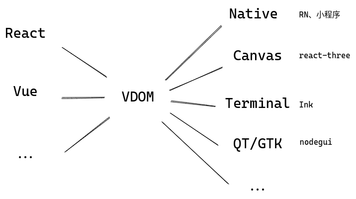

# 主流前端框架

## Web应用框架

本文主要介绍React和Vue，前者做为FP思想的范例，后者作为OOP思想的范例，把握住这两点，很多问题就迎刃而解了。后来出现的Svelte、Solid等，个人觉得只是在VDOM应用与否、模板预编译优化程度上的取舍，在Web这个特定场景可能有进一步的性能提升，但总体来说并没有特别让人眼前一亮的地方。而且我非常讨厌Svelte又双叒创造了一套模板语法的行为。

比较特殊的是Angular，将Spring那套控制反转和依赖注入的思想引入了前端应用的设计中，能够理解IOC和DI，并且知道[怎么用`reflect-metadata`实现装饰器](https://www.everseenflash.com/CS/Snippets/Macro.md#H047e72df69d52b2e)的话Angular也没什么神秘的。甚至有巨硬官方的[轮子](https://github.com/microsoft/tsyringe)可以复用。我的观点和社区里一些观点一致，Angular更适合专业性比较高的大型团队使用，想用好有一定的门槛和心智负担，普通开发者和小型团队使用可能还适得其反。

### Virtual DOM

写这篇文档的时候我思考了一下到底该如何表达出自己对React和Vue的理解，因为关于这两个框架的面试问题非常之多，有些浮于表面，只是一个毫无价值的实现细节或者接口特征，真正深入肌理的少之又少。为了避免在这些肤浅的面试问题上浪费太多生命，我决定做一件很早就想做却迟迟没有开始的事情：实现一个微型的React和Vue。让我们从Virtual DOM开始。

计算机行业貌似有一个段子，各种软件造来造去，最后发现其实都是在造编译器或者操作系统。这个段子对前端框架也适用，把JSX、Vue或其他什么框架的模板语法看成是输入，HTML看成是输出，那么各种前端框架不就是一个编译器吗？而VDOM，显而易见的，和AST/IR等处在同一个位置，是一种中间表示。中间表示最核心的优点是什么？提供一个抽象层，可以在其基础上做分析优化，可以实现为不同目标平台上的机器码。那么VDOM也类似的，通过对VDOM树的分析操作可以避免每次重新执行整个组件树，可以避免在内存中维护庞大的真实DOM结点，通过不同的后端（这里指编译器后端）实现，可以输出到不同的渲染平台，如下图：



假如前后端分离，服务器承担编译器前端的工作，负责生成VDOM，客户端承担编译期后端的工作，负责渲染VDOM，这是不是就是React正在探索的Server Components背后的思想？进一步畅想：如果随着技术的发展AR/VR已经大行其道，成为前端展示层的主流，难道我们就会抛弃现有的前端框架了吗？很可能不会，React/Vue说到底只是一套设计和管理前端应用的方法，也许那时只要在现有的VDOM基础上缝缝补补就可以输出为AR/VR的渲染指令。受此启发，像AST这种中间表示，现有的前端框架基本都是某种求值器，求值过程为创建对应的HTML元素，但AST还可以编译为IR进一步编译为在CPU上执行的二进制指令，类比一下完全有可能将VDOM编译为GPU渲染指令，并且将各种编译优化手段应用到这个过程中去。这也是我当前正在探索的东西。

作为示例，我们设计一套极简的VDOM，只有几个结点类型：

1. `fragment`，类似React中的`<></>`，用于组织元素；
2. `div`，作用和HTML的块级元素类似；
3. `text`，代表纯文本；
4. `button`，用于演示用户操作。支持的HTML属性也非常有限，只有`style`和`onclick`。

#### 求值器

下面以`button`为例说明它们的类型定义和“求值”过程，完整代码见[这里](https://github.com/EverSeenTOTOTO/mini-framework/blob/main/src/vdom/index.ts)：

```ts
export type VNodeButton = {
  tag: 'button',
  attr?: {
    style?: AttrStyle,
    onClick?: AttrEvent
  },
  children: VNode[],
};

// ...

export type VNode = VNodeFragment | VNodeText | VNodeDiv | VNodeButton;
```

```ts
export function evalButton(node: ts.VNodeButton): HTMLButtonElement {
  const btn = document.createElement('button');

  if (node.attr?.style) {
    bindStyle(btn, node.attr.style);
  }

  if (node.attr?.onClick) {
    btn.addEventListener('click', node.attr.onClick);
  }

  btn.append(...evalSeq(node.children)); // 递归下降

  return btn;
}
```

为了方便构造VDOM树，还可以编写一个工厂函数`createElement`，作用等同于React的`createElement`和Vue渲染函数中的`h`：

```ts
const createElement = <Tag extends VNodeTags>(tag: Tag) =>
  (children: (VNode | string)[], attr?: GetVNodeAttrType<Tag>) => ({
    tag,
    attr,
    children: children.map(mapVNode),
  } as GetVNodeType<Tag>);

export const fragment = createElement('fragment');
export const div = createElement('div');
export const button = createElement('button');
```

这样我们的框架后端（指编译器后端，在这里是求值器）就初步可用了，下面是一个简单的用例：

```html
<script>
  const {fragment, div, button} = window.Demo;

  const vdom = fragment([
    div(
      ['Hello World'],
      {
        style: {
          width: 300,
          height: 50,
          color: 'blue',
          bgColor: '#e4e4e4'
        },
      },
    ),
    button(
      ['Click Me'],
      {
        onClick: () => console.log('hello world'),
      },
    ),
  ]);
</script>
<script>
  const {evalVNode} = window.Vue;

  document.body.append(...evalVNode(vdom));
</script>
```

渲染效果如下：


#### 编译器

如前文所述，既然求值可行，那我们把同一套VDOM翻译成渲染指令（类比汇编代码）保存下来当然也是可行的。为此让我们先设计几个简单的虚拟渲染指令：

1. `moveTo x, y`: 移动指针到坐标`(x, y)`处；
2. `fillStyle style`: 改变填充色；
3. `stokeStyle style`: 改变描边色；
4. `fontStyle family, size`: 改变字体样式；
5. `fillRect x, y, w, h`: 填充矩形，左上角位置`(x, y)`，宽高为`(w, h)`；
6. `stokeRect x, y, w, h`: 描边矩形，左上角位置`(x, y)`，宽高为`(w, h)`；
7. `fillText text, x, y, maxw`: 在`(0, 0)`处绘制文本，最大宽度`maxw`；
8. `reset`: 重置笔刷状态为默认值，重置指针到`(0, 0)`；
9. `save`: 保存笔刷状态（将颜色、字体大小等入栈）；
10. `restore`: 恢复笔刷状态（设置笔刷为栈顶状态）。

```ts
export type InstFillText = {
  name: 'fillText';
  text: string,
  x: number,
  y: number,
  maxw?: number
};

// ...

export type RenderInsts = InstMoveTo |
  InstFillStyle |
  InstStrokeStyle |
  InstFontStyle |
  InstFillRect |
  InstStrokeRect |
  InstFillText |
  InstReset |
  InstSave |
  InstRestore;
```

指令实现用的Canvas API，~其实设计也抄的Canvas API~。再次以`button`为例，给出翻译VDOM结点为渲染指令的过程，完整代码在[这里](https://github.com/EverSeenTOTOTO/mini-framework/blob/main/src/vdom/target-canvas.ts)：

```ts
export function emitButton(node: ts.VNodeButton, ctx: Context): RenderInst[] {
  const insts: RenderInst[] = [];
  const style = {
    // default button style
    width: 67,
    height: 21,
    color: '#000',
    bgColor: 'buttonface',
    ...node.attr?.style,
  };

  insts.push({ name: 'save' });
  insts.push(
    {
      name: 'fillStyle',
      style: style.bgColor,
    },
    { // 绘制按钮背景
      name: 'fillRect',
      x: ctx.x,
      y: ctx.y,
      w: style.width,
      h: style.height,
    },
    {
      name: 'strokeStyle',
      style: '#000',
    },
    { // 绘制按钮边框
      name: 'strokeRect',
      x: ctx.x,
      y: ctx.y,
      w: style.width,
      h: style.height,
    },
  );

  if (style.color) {
    insts.push({
      name: 'fillStyle',
      style: style.color,
    });
  }

  insts.push(...emitSeq(node.children, ctx)); // 递归下降

  if (node.attr?.onClick) {
    // 绑定canvas click事件，判断鼠标点击落点是否在区域内
    bindCanvasClick(node.attr.onClick, style, ctx);
  }

  insts.push({ name: 'restore' });

  return insts;
}
```

还是前面用例中的`vdom`，编译后得到如下渲染指令：

```js
[
  { name: 'reset' },
  { name: 'moveTo', x: 0, y: 0 },
  { name: 'fontStyle', size: 16, family: 'sans-serif' },
  { name: 'comment', message: 'fragment 0 start' },
  { name: 'save' },
  { name: 'fillStyle', style: '#e4e4e4' },
  { name: 'fillRect', x: 0, y: 0, w: 300, h: 50 },
  { name: 'fillStyle', style: 'blue' },
  { name: 'fillText', text: 'Hello World', x: 0, y: 16 },
  { name: 'restore' },
  { name: 'moveTo', x: 0, y: 50 },
  { name: 'save' },
  { name: 'fillStyle', style: 'buttonface' },
  { name: 'fillRect', x: 0, y: 50, w: 67, h: 21 },
  { name: 'strokeStyle', style: '#000' },
  { name: 'strokeRect', x: 0, y: 50, w: 67, h: 21 },
  { name: 'fillStyle', style: '#000' },
  { name: 'fillText', text: 'Click Me', x: 0, y: 66 },
  { name: 'restore' },
  { name: 'comment', message: 'fragment 0 end' },
],
```

这次在`canvas`上绘制，渲染效果看着还是挺唬人的：

```html
<script>
  const {emitInsts, execInst} = window.Demo;
  const canvas = document.createElement('canvas');

  canvas.width = 800;
  canvas.height = 400;

  const container = document.createElement('div');
  container.append(canvas);
  document.body.append(container);

  const ctx = canvas.getContext('2d');
  const insts = emitInsts(vdom);

  insts.forEach(inst => execInst(inst, ctx));
</script>
```


### React

#### React Fiber

#### React hooks

#### React18的启示

### Vue

#### 观察者模式与对象代理

#### 依赖倒置原则与双向绑定

#### Vue3 hooks

### 状态管理与DDD

#### RxJS

## 单元测试

## 跨端解决方案

## 服务端框架

### Express和Koa

### Nest.js

### SSR框架

## 国际化与a11y

