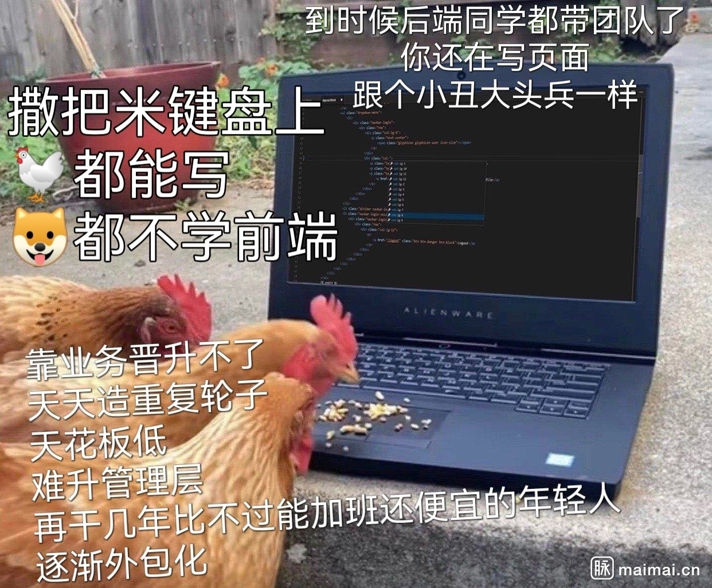

# Frontend Interview

前端面试前结合搜罗的各种面试问题对自身知识体系进行的一次梳理，难免有力所未逮的地方。有更深入的理解也将不定期更新。

[[仓库地址](https://github.com/EverSeenTOTOTO/frontend-interview)] [[在线访问](https://cv.everseenflash.com/)]

## 目录

+ [Javascript相关](./Javascript.md)
+ [Typescript相关](./Typescript.md)
+ [NodeJS相关](./NodeJS.md)
+ [Web相关](./Web.md)
+ [CSS相关](./CSS.md)
+ [主流前端框架](./Framework.md)
+ [前端工程化](./Engineering.md)
+ [前端性能优化](./PerformanceOptimization.md)
+ [前端与算法和数据结构](./DataStructure-Algorithm.md)
+ [前端与操作系统](./OS.md)
+ [前端与编译原理](./Compiler.md)
+ [前端与计算机网络](./Network.md)
+ [前端与数据库](./Database.md)
+ [前端与容器和云](./Cloud.md)
+ [Web Assembly相关](./WebAssembly.md)
+ [Web3相关](./Web3.md)
+ [工作经验谈](./Experience.md)
+ [假如我负责技术面](./Interview.md)

## 段子

鸡米键盘.jpeg：

---

虽然是个段子图，不过也说出了初级前端开发者的一些困境：入门门槛低，从业者良莠不齐，存在竞争压力；日常需求技术深度不足，容易化身“切图仔”，出现“一年工作经验用了十年”的情况，有经验积累，但缺乏技术进步；知识广度上也容易闭塞视野，用我自己的话说就是总是处于下游，总在学“新东西”，偶尔有一些发挥能动性和创造力的机会，也往往是“重复造轮子”。在这种情况下，部分开发者想到的方法不是实事求是提升自己，做大蛋糕，而是“把水搅浑”，故弄玄虚发明词汇，人为构建行业壁垒，最后往往是一地鸡毛，不仅恶化行业生态，更浪费了社会资源。

这段话是一个年轻从业者的迷茫与困惑之处，一些牢骚，因此未免有井蛙夏虫管窥蠡测之嫌。我的困惑之处在于有时我觉得很多前端需求都是“[Bullshit Jobs](https://en.wikipedia.org/wiki/Bullshit_Jobs)”，我从事前端开发大约三年，最珍重的一段时光是其中做前端工程化和性能优化的一年，因为切切实实感受到自己的工作节约了很多客户的时间，很有成就感。但更多时候，我对手边需求的感觉是“一部分人相互折腾创造KPI或OKR，另一部分人看破不说破，将这些Bullshit包装再包装，层层嵌套层层下发，造成虚假繁荣的景象”，你糊弄我我应付他，甚至不断训练自己欺骗自己这些不是泡沫，一边与客观实在脱节一边自我感觉良好，除了浪费生产力之外没有做出任何贡献，直到冷冰冰的现实袭来，歌舞楼台轰然倒塌，于是“树倒猢狲散”，出现所谓寒冬，落了片白茫茫大地真干净。

这种虚浮焦虑的感觉近两年一直折磨着我，终于忍不住离职，除了恶补一番以前浪荡荒废的专业课程稳固基础之外，剩下的时间就在思考职业生涯的得失。事实上我自认并不是个“愤青”，有时我也试图站在另一个角度思考问题，反思自己，用《大明王朝1566》的台词来说：“就只有你是忠臣、良臣、贤臣？”有时我会觉得自己的观点太偏颇太做作，也许“摆烂”才是历史的常态，我所深恶痛绝的一些现象不过是“80-20”原则中的80，社会其实一直在向前发展的，但这种发展不是精打细算细水长流的发展，也不是高台垒土，相反我们总是生产生产再生产，浪费浪费再浪费，倒塌重建螺旋上升才是发展的必由。大多数人，当然也包括我自己，都是裹挟在江河湖海中的一点小水滴而已，想得太多反而会伤到自己。什么叫做“门槛太低阿猫阿狗都来分一杯羹”呢，大家都只是混口饭吃，当下计算机行业这碗饭略香，量大管饱，对没有能力自己做饭的人来说趋之若骛又有什么错呢？什么叫互联网黑话、摸鱼、内卷呢？都是保住饭碗的手段罢了。甚至这些根本不是“摆烂”，卷考研卷考公卷这卷那，代码写得烂多少完成了需求，产生了BUG也变相产生了工时，重复造轮子换个说法就是学习方法论和避免中心化，一切都是普通人努力生活的手段与例证罢了，普通人的挣扎与奋斗，谁有资格高高在上地谴责呢？

越是这样去想，矛盾与荒诞感就越强烈。我不知道这个话题该如何收尾，如果这段话非得有个结尾的话，我只能说我依然喜爱着前端，喜欢前端的表现力与蓬勃的生态。前端当然不只是切图仔，前端还有很多事情值得去做，哪怕是业务需求也可以设法做得漂亮。也许对我们普通人来说，管好自己，怜取眼前人就是极好的了。
